<div align="center">
	

<h3 align="center">Indie Blueprint Scene Transition</h3>

  <p align="center">
  	This scene transitioner implifies scene switching in your Godot project, adding polish and visual flair to your game's level changes
	<br />
	·
	<a href="https://github.com/ninetailsrabbit/indie-blueprint-scene-transition/issues/new?assignees=ninetailsrabbit&labels=%F0%9F%90%9B+bug&projects=&template=bug_report.md&title=">Report Bug</a>
	·
	<a href="https://github.com/ninetailsrabbit/indie-blueprint-scene-transition/issues/new?assignees=ninetailsrabbit&labels=%E2%AD%90+feature&projects=&template=feature_request.md&title=">Request Features</a>
  </p>
</div>

<br>
<br>

- [Installation 📦](#installation-)
- [Features ✨](#features-)
- [How to use 📜](#how-to-use-)
  - [Premade transitions 🎭](#premade-transitions-)
    - [Fade](#fade)
    - [Voronoi](#voronoi)
    - [Dissolve](#dissolve)
      - [Blurry noise](#blurry-noise)
      - [Cell noise](#cell-noise)
      - [Circle inverted](#circle-inverted)
      - [Circle](#circle)
      - [Conical](#conical)
      - [Curtains](#curtains)
      - [Horizontal paint brush](#horizontal-paint-brush)
      - [Vertical paint brush](#vertical-paint-brush)
      - [Noise pixelated](#noise-pixelated)
      - [Normal Noise](#normal-noise)
      - [Scribbles](#scribbles)
      - [Square](#square)
      - [Squares](#squares)
      - [Swirl](#swirl)
      - [Tile reveal](#tile-reveal)
      - [Wipe down](#wipe-down)
      - [Wipe up](#wipe-up)
      - [Wipe left](#wipe-left)
      - [Wipe right](#wipe-right)
  - [Transition to scene 📽️](#transition-to-scene-️)
  - [Transition to scene with loading screen 🎬](#transition-to-scene-with-loading-screen-)
    - [Create your loading screen](#create-your-loading-screen)
- [Create your own transitions ⚒️](#create-your-own-transitions-️)
  - [Add your configuration](#add-your-configuration)
    - [The IndieBlueprintSceneTransitionConfiguration Resource](#the-indieblueprintscenetransitionconfiguration-resource)
    - [The IndieBlueprintSceneTransition Class](#the-indieblueprintscenetransition-class)

# Installation 📦

1. [Download Latest Release](https://github.com/ninetailsrabbit/indie-blueprint-scene-transition/releases/latest)
2. Unpack the `addons/indie-blueprint-scene-transition` folder into your `/addons` folder within the Godot project
3. Enable this addon within the Godot settings: `Project > Project Settings > Plugins`

To better understand what branch to choose from for which Godot version, please refer to this table:
|Godot Version|indie-blueprint-scene-transition Branch|indie-blueprint-scene-transition Version|
|---|---|--|
|[](https://godotengine.org/)|`4.3`|`1.x`|
|[](https://godotengine.org/)|`main`|`1.x`|

# Features ✨

- **Seamless Transitions:** Transition between scenes using animations or effects, enhancing the user experience.
- **Loading Screen Integration:** Optionally display a loading screen while heavier scenes load, providing feedback to players.
- **Flexibility:** Supports both file paths and pre-loaded PackedScene resources for scene selection.
- **Customizable Transitions:** Define your own transition animations and effects within the manager for a personalized touch.
- **Clear API:** The `transition_to` function offers a user-friendly way to initiate scene changes with various parameters.

# How to use 📜

The `IndieBlueprintSceneTransitioner` has 2 main functions, `transition_to` and `transition_to_with_loading_screen`, these are the only ones you need to change between scenes.

## Premade transitions 🎭

This plugin already comes with some premade transitions, which are:

- **Fade**
- **Voronoi**
- **Dissolve** _(with many textures to visualize different effects)_

Since they are already made, from the class `IndieBlueprintPremadeTransitions` you can access their identifiers as well as the textures for the dissolve type.

```swift
class_name IndieBlueprintPremadeTransitions extends RefCounted

const ColorFade: StringName = &"color_fade"
const Voronoi: StringName = &"voronoi"
const Dissolve: StringName = &"dissolve"


const BlurryNoise: CompressedTexture2D = preload("res://addons/ninetailsrabbit.indie_blueprint_scene_transition/src/transitions/dissolve/textures/blurry-noise.png")

const CellNoise: CompressedTexture2D = preload("res://addons/ninetailsrabbit.indie_blueprint_scene_transition/src/transitions/dissolve/textures/cell-noise.png")

const CircleInverted: CompressedTexture2D = preload("res://addons/ninetailsrabbit.indie_blueprint_scene_transition/src/transitions/dissolve/textures/circle-inverted.png")

const Circle: CompressedTexture2D = preload("res://addons/ninetailsrabbit.indie_blueprint_scene_transition/src/transitions/dissolve/textures/circle.png")

const Conical: CompressedTexture2D = preload("res://addons/ninetailsrabbit.indie_blueprint_scene_transition/src/transitions/dissolve/textures/conical.png")

const Curtains: CompressedTexture2D = preload("res://addons/ninetailsrabbit.indie_blueprint_scene_transition/src/transitions/dissolve/textures/curtains.png")

const HorizontalPaintBrush: CompressedTexture2D = preload("res://addons/ninetailsrabbit.indie_blueprint_scene_transition/src/transitions/dissolve/textures/horiz_paint_brush.png")

const NoisePixelated: CompressedTexture2D = preload("res://addons/ninetailsrabbit.indie_blueprint_scene_transition/src/transitions/dissolve/textures/noise-pixelated.png")

const NormalNoise: CompressedTexture2D = preload("res://addons/ninetailsrabbit.indie_blueprint_scene_transition/src/transitions/dissolve/textures/noise.png")

const Scribbles: CompressedTexture2D = preload("res://addons/ninetailsrabbit.indie_blueprint_scene_transition/src/transitions/dissolve/textures/scribbles.png")

const Square: CompressedTexture2D = preload("res://addons/ninetailsrabbit.indie_blueprint_scene_transition/src/transitions/dissolve/textures/square.png")

const Squares: CompressedTexture2D = preload("res://addons/ninetailsrabbit.indie_blueprint_scene_transition/src/transitions/dissolve/textures/squares.png")

const Swirl: CompressedTexture2D = preload("res://addons/ninetailsrabbit.indie_blueprint_scene_transition/src/transitions/dissolve/textures/swirl.png")

const TileReveal: CompressedTexture2D = preload("res://addons/ninetailsrabbit.indie_blueprint_scene_transition/src/transitions/dissolve/textures/tile_reveal.png")

const VerticalPaintBrush: CompressedTexture2D = preload("res://addons/ninetailsrabbit.indie_blueprint_scene_transition/src/transitions/dissolve/textures/vertical_paint_brush.png")

const WipeDown: CompressedTexture2D = preload("res://addons/ninetailsrabbit.indie_blueprint_scene_transition/src/transitions/dissolve/textures/wipe-down.png")

const WipeLeft: CompressedTexture2D = preload("res://addons/ninetailsrabbit.indie_blueprint_scene_transition/src/transitions/dissolve/textures/wipe-left.png")

const WipeRight: CompressedTexture2D = preload("res://addons/ninetailsrabbit.indie_blueprint_scene_transition/src/transitions/dissolve/textures/wipe-right.png")

const WipeUp: CompressedTexture2D = preload("res://addons/ninetailsrabbit.indie_blueprint_scene_transition/src/transitions/dissolve/textures/wipe-up.png")
```

### Fade

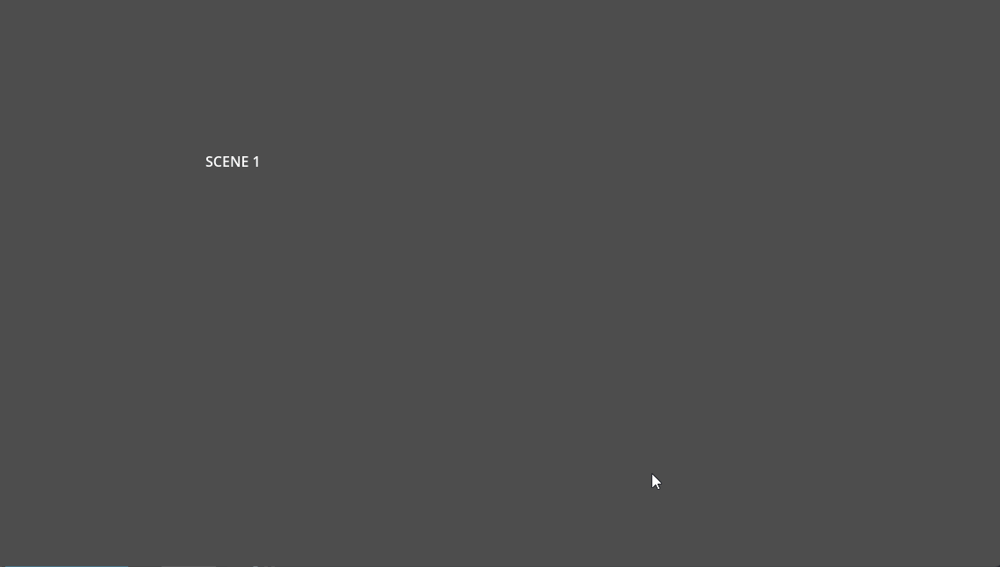

---

```swift
// Arguments that can receive in the dictionary
var color: Color
var duration: float

{
	"in": {
		"color": Color.BLACK,
		"duration": 1.5
	},
	"out": {
		"color": Color.WHITE,
		"duration": 1.0
	},
}
```

### Voronoi

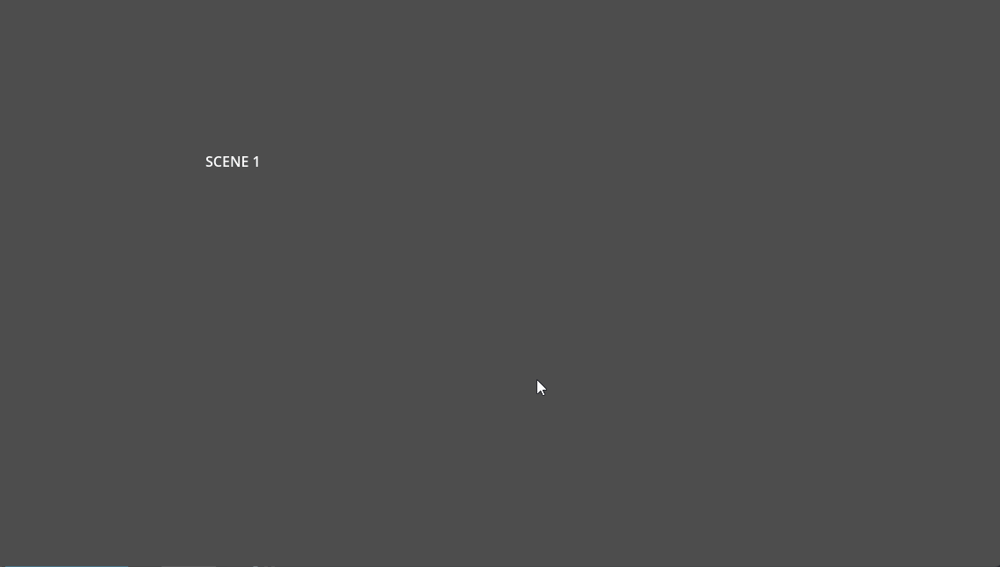

---

```swift
// Arguments that can receive in the dictionary
var color: Color
var duration: float
var flip: bool // false -> from left to right | true -> from right to left


{
	"in": {
		"color": Color.YELLOW,
		"duration": 1.5,
		"flip": true
	},
	"out": {
		"color": Color.YELLOW,
		"duration": 1.0,
		"flip": true
	},
}
```

### Dissolve

You can provide your own textures and you do not necessarily have to use the ones proposed by the plugin.

```swift
// Arguments that can receive in the dictionary
var color: Color
var duration: float
var texture: CompressedTexture2D


{
	"in": {
		"color": Color.YELLOW,
		"duration": 1.5,
		"texture": IndieBlueprintPremadeTransitions.Swirl
	},
	"out": {
		"color": Color.YELLOW,
		"duration": 1.0,
		"texture": IndieBlueprintPremadeTransitions.Swirl
	},
}
```

#### Blurry noise

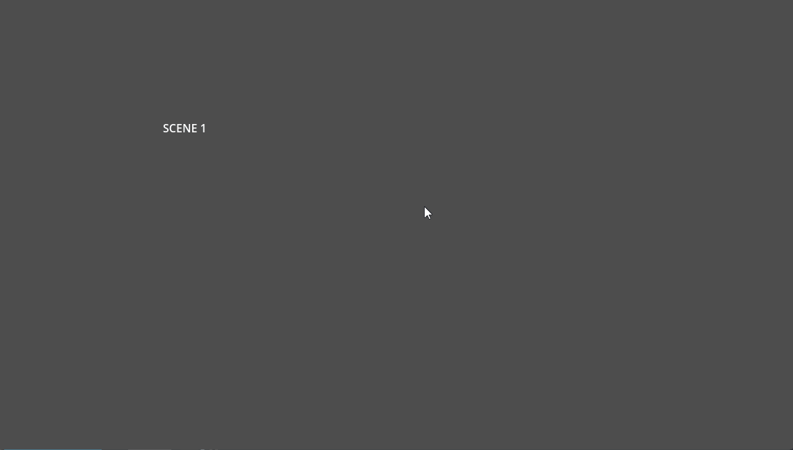

#### Cell noise

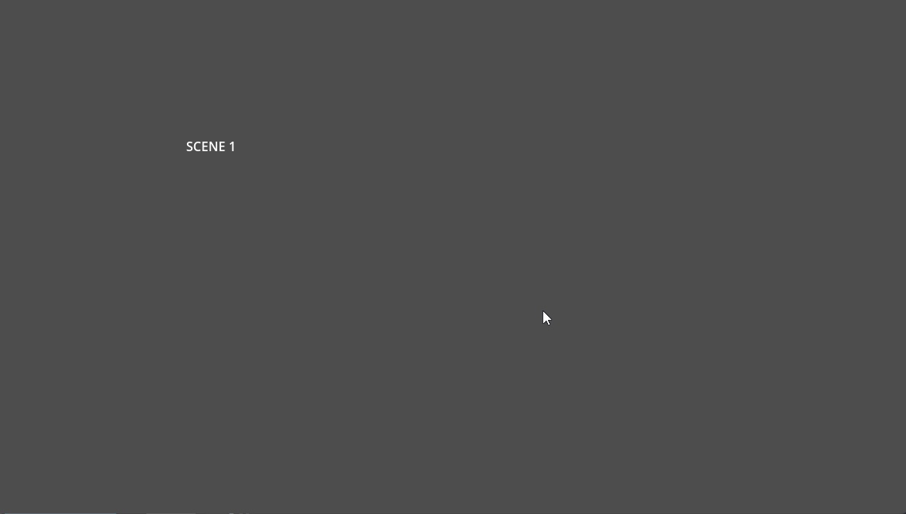

#### Circle inverted

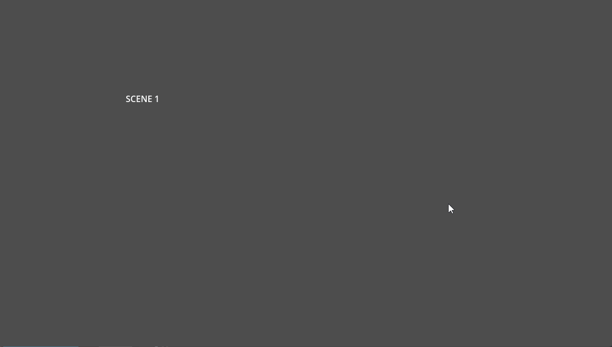

#### Circle

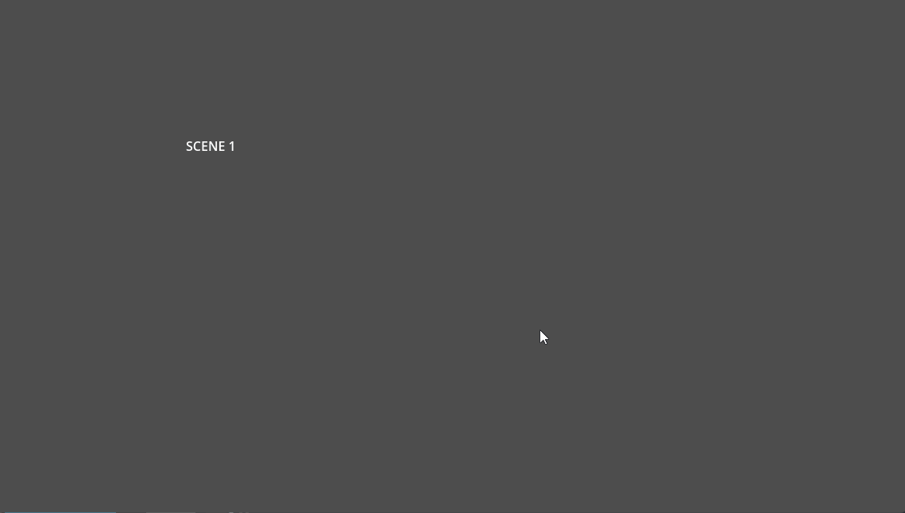

#### Conical

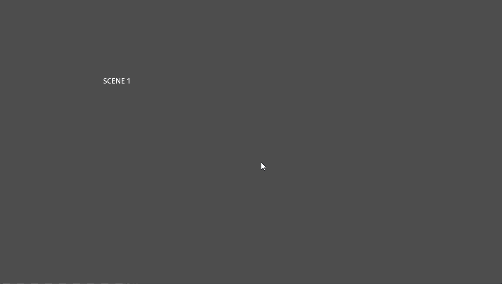

#### Curtains

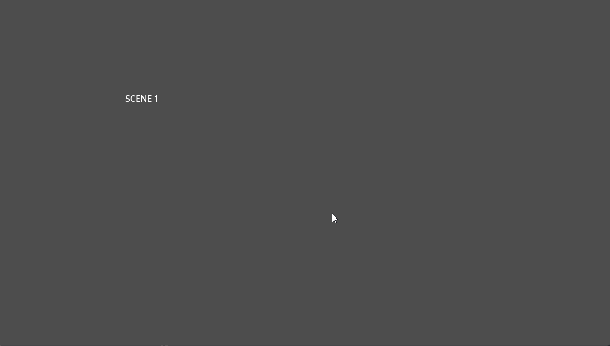

#### Horizontal paint brush

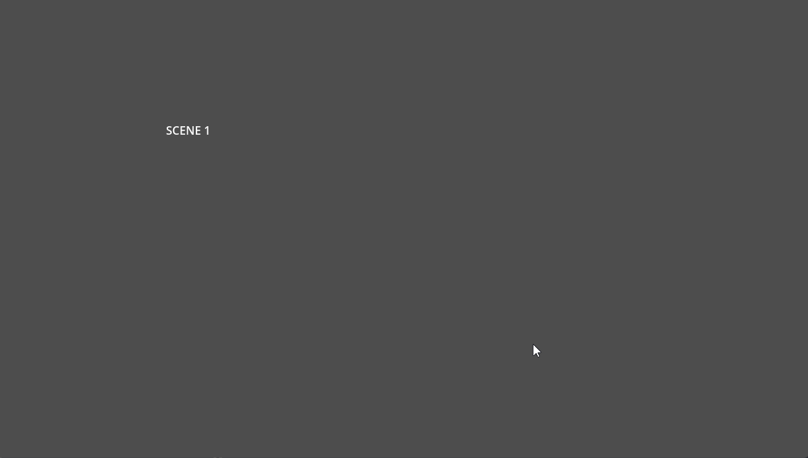

#### Vertical paint brush

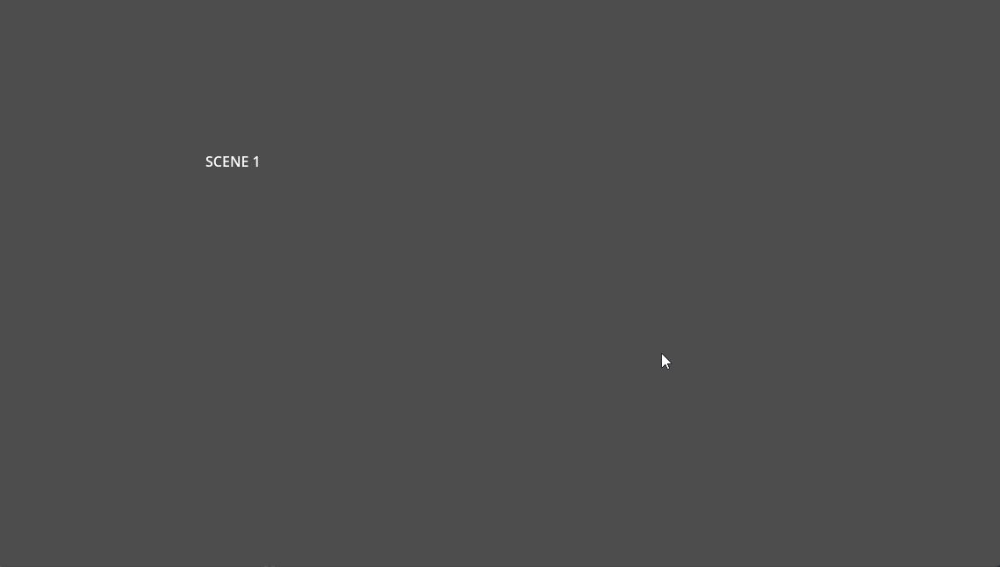

#### Noise pixelated

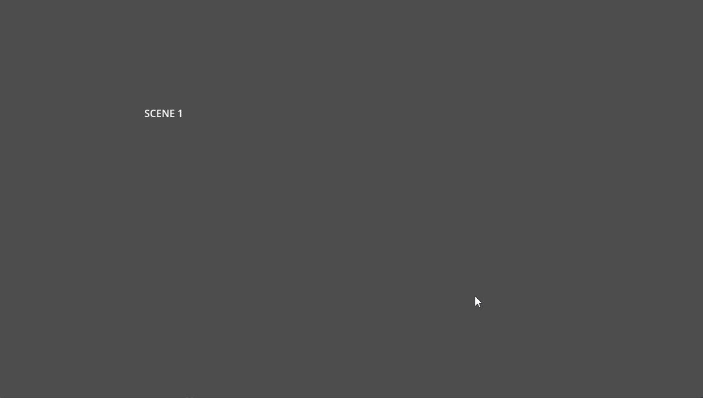

#### Normal Noise

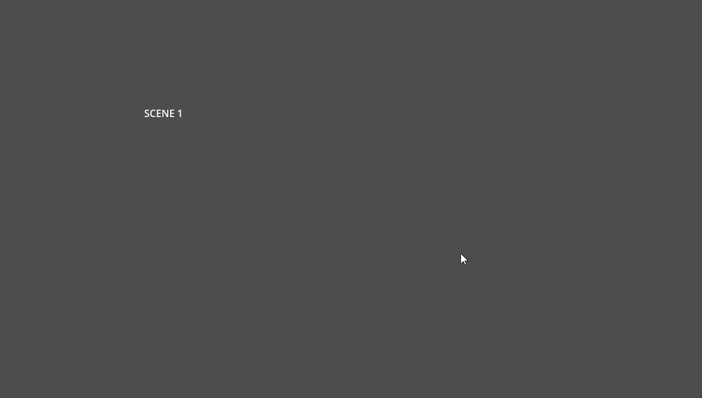

#### Scribbles

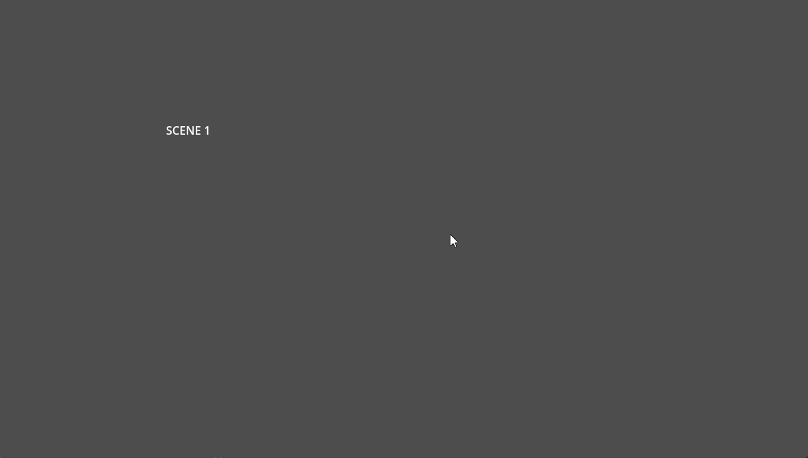

#### Square


#### Squares

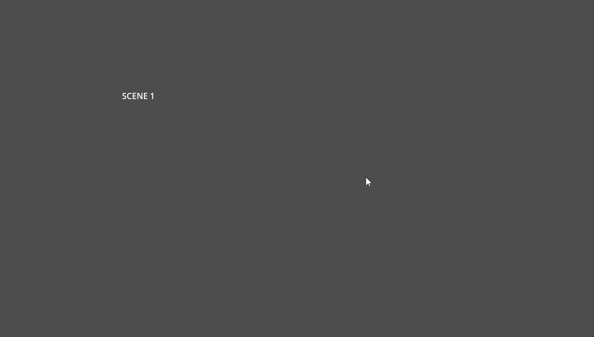

#### Swirl

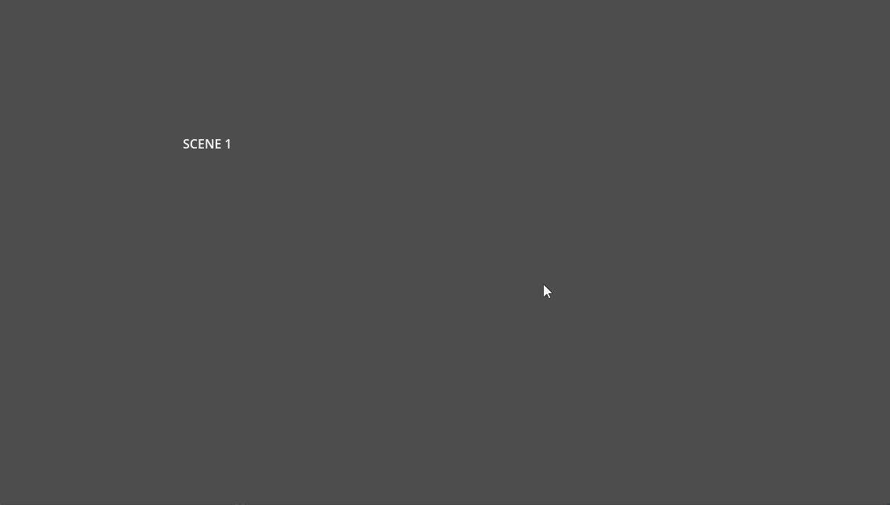

#### Tile reveal

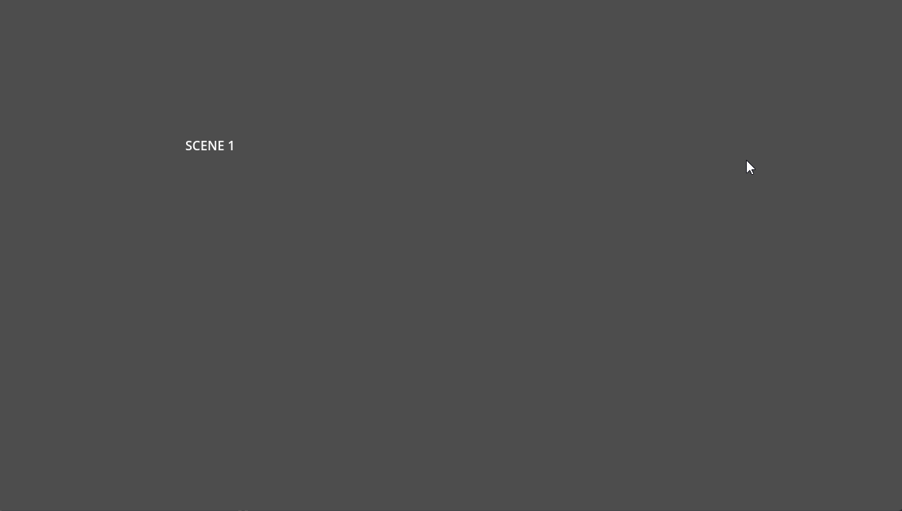

#### Wipe down

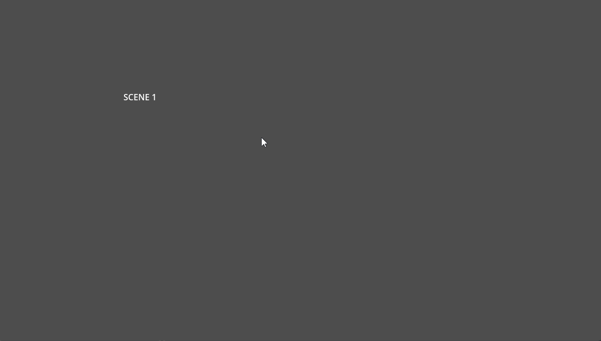

#### Wipe up

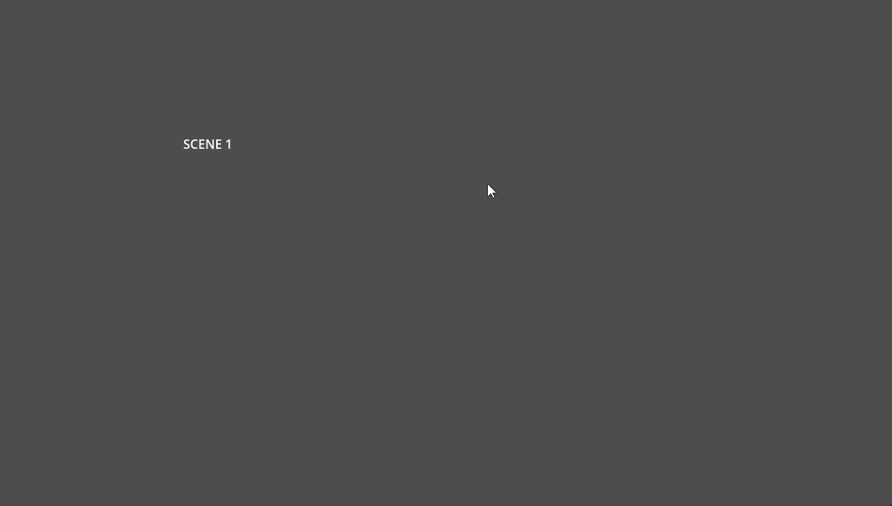

#### Wipe left


#### Wipe right


## Transition to scene 📽️

The scene can be provided as `String path` or as `PackedScene`. Each transition will receive the arguments it needs in the `args` Dictionary. This is because it is a flexible structure that allows you to pass anything to your own transitions.

```swift
func transition_to(
	scene: Variant,
	in_transition_id: StringName = IndieBlueprintPremadeTransitions.ColorFade,
	out_transition_id: StringName = IndieBlueprintPremadeTransitions.ColorFade,
	// A dictionary with "in" and "out" keys to pass the arguments to the corresponding transitions
	args: Dictionary = {}
) -> void


// Example
IndieBlueprintSceneTransitioner.transition_to(
	"res://test_scene_2.tscn",
	IndieBlueprintPremadeTransitions.Dissolve,
	IndieBlueprintPremadeTransitions.Dissolve,
	{ 	"in": {"texture": IndieBlueprintPremadeTransitions.HorizontalPaintBrush, "duration": 1.0, "color": Color.LIGHT_SKY_BLUE},
		"out": {"texture": IndieBlueprintPremadeTransitions.VerticalPaintBrush, "duration": 1.5, "color": Color.LIGHT_SEA_GREEN,}
	}
)

```

## Transition to scene with loading screen 🎬

The `scene` and `loading_screen_scene` can be provided as `String path` or as `PackedScene`. The loading screen can be a custom scene where the root node inherits from `IndieBlueprintLoadingScreen`

```swift
func transition_to_with_loading_screen(
	scene: Variant,
	loading_screen_scene: Variant,
	in_transition_id: StringName = IndieBlueprintPremadeTransitions.ColorFade,
	out_transition_id: StringName = IndieBlueprintPremadeTransitions.ColorFade,
	## A dictionary with "in" and "out" keys to pass the arguments to the corresponding transitions
	args: Dictionary = {}
	) -> void:
```

### Create your loading screen

There is available an example in this repository located in `res://test_scenes/example_loading_screen.tscn`. The only thing you really need from the script provided is the value of the current loading progress.

As previously mentioned, since it is your own scene you can design it as you need it

```swift
class_name IndieBlueprintExampleLoadingScreen extends IndieBlueprintLoadingScreen


@onready var color_rect: ColorRect = $ColorRect
@onready var progress_bar: ProgressBar = $ProgressBar


func _process(delta: float) -> void:
	super._process(delta) // Don't forget to call the parent _process() to update the value

	progress_bar.value = current_progress_value
```

# Create your own transitions ⚒️

Thanks to a simple API, creating a transition is as easy as:

- Create a scene where the root node is of type `Control`
- Create and attaching a script that extends `IndieBlueprintSceneTransition` to this scene
- Developing your own logic on the overridable functions `transition_in` and `transition_out`
- Create an `IndieBlueprintSceneTransitionConfiguration` resource and assigning a unique identifier and the new scene of your custom transition
- Add this resource to the exportable transitions parameter of the scene `res://addons/ninetailsrabbit.indie_blueprint_scene_transition/src/scene_transitioner.tscn`

You can take a look at the transitions already made in this plugin to see how to create your own. Since it's a custom scene, you can add the nodes that are necessary, providing unlimited flexibility.

## Add your configuration

For the `IndieBlueprintSceneTransitioner` to know a transition it must exist as a resource in the parameter `transitions`.

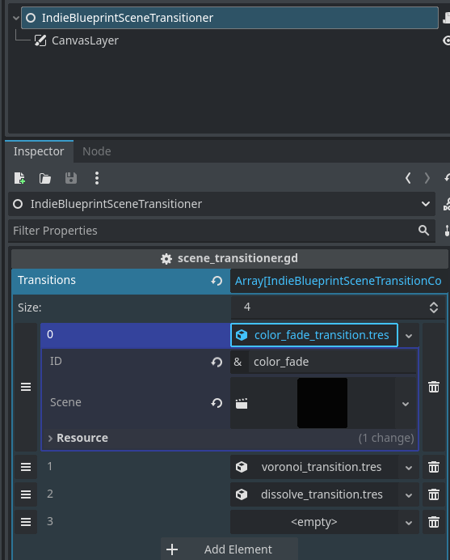

### The IndieBlueprintSceneTransitionConfiguration Resource

It is a very simple resource that needs an identifier and the related transition scene.

```swift
class_name IndieBlueprintSceneTransitionConfiguration extends Resource

@export var id: StringName
@export var scene: PackedScene
```

### The IndieBlueprintSceneTransition Class

```swift
class_name IndieBlueprintSceneTransition extends Control

signal in_transition_started
signal in_transition_finished

signal out_transition_started
signal out_transition_finished

@export var default_z_index: int = 100


func transition_in(args: Dictionary = {}) -> void:
	pass


func transition_out(args: Dictionary = {}) -> void:
	pass

// We provide an optional function to prepare a color rect that add some optimal common parameters for a transition
func prepare_color_rect(color_rect: ColorRect) -> ColorRect:
	color_rect.set_anchors_preset(PRESET_FULL_RECT)
	color_rect.mouse_filter = Control.MOUSE_FILTER_STOP
	color_rect.z_index = default_z_index

	return color_rect
```

**Example of fade**

**_You have to manually call the inherited signals when your transitions start or end.This is the way to let the `IndieBlueprintSceneTransitioner` know that your transition has started and ended._**

`args`is the dictionary that you send from the main functions `transition_to` and `transition_to_with_loading_screen`

```swift
class_name ColorFadeTransition extends IndieBlueprintSceneTransition

@export var default_color: Color = Color("050505")
@export var default_duration: float = 1.0
@export var in_start_modulate: int = 0
@export var out_start_modulate: int = 255
@onready var color_rect: ColorRect = $ColorRect


func _ready() -> void:
	prepare_color_rect(color_rect)
	color_rect.modulate.a8 = 0


func transition_in(args: Dictionary = {}) -> void:
	in_transition_started.emit()

	prepare_color_rect(color_rect)
	color_rect.color = args.get_or_add("color", default_color)
	color_rect.modulate.a8 = in_start_modulate

	var tween = create_tween()
	tween.tween_property(color_rect, "modulate:a8", 255, args.get_or_add("duration", default_duration))\
		.set_ease(Tween.EASE_IN).set_trans(Tween.TRANS_QUAD)

	tween.finished.connect(func(): in_transition_finished.emit(), CONNECT_ONE_SHOT)


func transition_out(args: Dictionary = {}) -> void:
	out_transition_started.emit()

	prepare_color_rect(color_rect)
	color_rect.color = args.get_or_add("color", default_color)
	color_rect.modulate.a8 = out_start_modulate

	var tween = create_tween()
	tween.tween_property(color_rect, "modulate:a8", 0, args.get_or_add("duration", default_duration))\
		.set_ease(Tween.EASE_IN).set_trans(Tween.TRANS_QUAD)

	tween.finished.connect(func(): out_transition_finished.emit(), CONNECT_ONE_SHOT)
```
